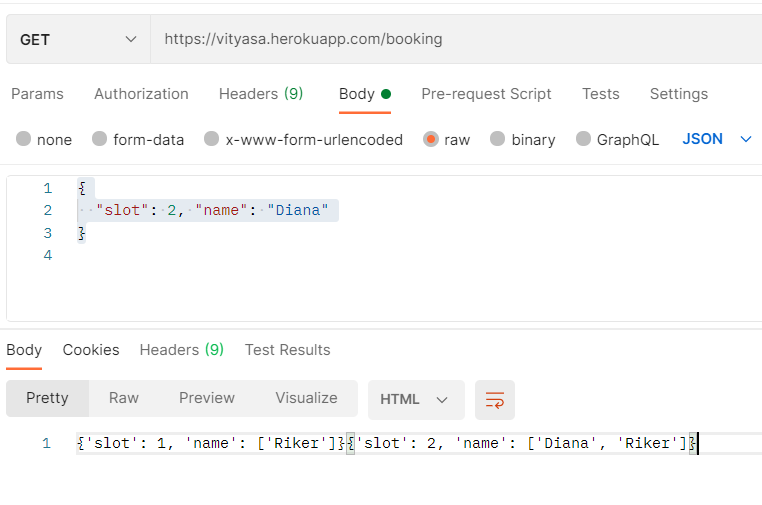

# Vityasa Internship
### Question 1
POST https://vityasa.herokuapp.com/items

[1, 4, -1, "hello", "world", 0, 10, 7]

{
  "valid_entries": 4,
  "invalid_entries": 4,
  "min": 1,
  "max": 10,
  "average": 5.5
}

### Question 2

POST https://vityasa.herokuapp.com/booking

{
  "slot": 1, "name": "John"
}

{"status":"confirmed booking for John in slot 1"}

GET https://vityasa.herokuapp.com/booking

{'slot': 1, 'name': ['John', 'Diana']}

POST https://vityasa.herokuapp.com/cancel

{
  "slot": 1, "name": "Diana"
}

{ "status":"canceled booking for Diana in slot 1"}

### Question 3

POST https://vityasa.herokuapp.com/plot

{
  "x": 1, "y": 1
}

{"status": "accepted"}

POST https://vityasa.herokuapp.com/plot

{
  "x": 5, "y": 5
}

{"status": "Success (1, 1) (1, 5) (5, 1) (5, 5)"}

